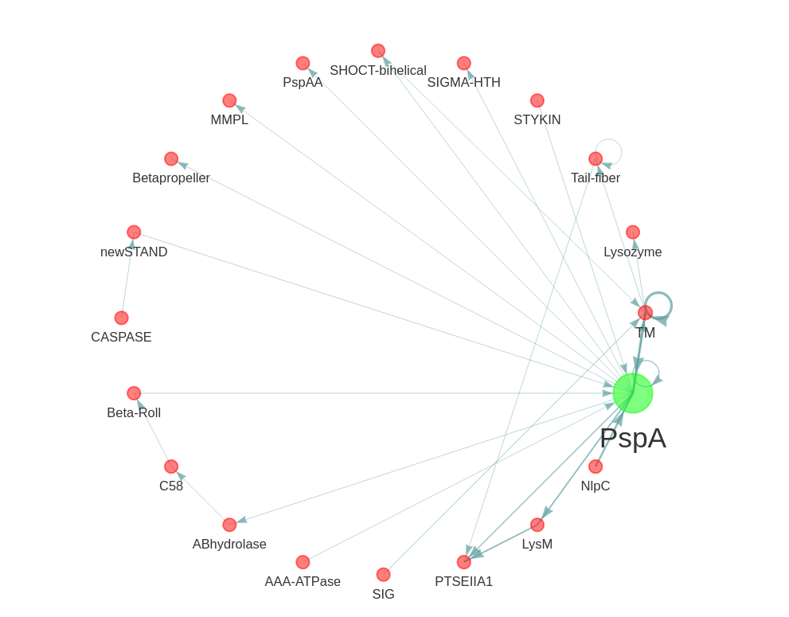

# MolEvolvR BTS: When and how to build a web-app and software package?
_Companion repository for the half-day workshop at [GLBIO 2023](https://www.iscb.org/glbio2023-programme/workshops-tutorials)_

## What's this workshop about?
We recently developed a web application, [MolEvolvR](http://jravilab.org/molevolvr) ([DOI](https://doi.org/10.1101/2022.02.18.461833)), to characterize proteins using molecular evolution and phylogeny. This session will serve as a behind-the-scenes (BTS) sneak peek into what MolEvolvR does, how it does it, and its origin story. The hands-on training component will provide the basic principles of why and how to build a dashboard/web-app for your biological problem of interest with R/Shiny, and when and how you would set up your back-end as an R package.

**Workshop outline** | _Rationale with hands-on component_

- Demo and motivation: A quick preview of our [MolEvolvR web-app](http://jravilab.org/molevolvr) (and a use-case demo with [PSP operon](https://jravilab.shinyapps.io/psp-evolution)). How did these special cases translate to a more generalizable user-friendly version?
- When are you ready to set up a dashboard? When would you build a simple web-application instead?
- How do you pick your feature list for your web-app? Some lessons and reflections. When is a feature function, package, or web-app ready?
- Project management 101: how to set up version-controlled projects and repositories for collaborative computational biology projects (with other dry/wet-lab colleagues)?
- Dashboard 101: How to develop a dashboard for your data/visualizations using Rmarkdown/Quarto?
- Web-app 101: How to develop and host an interactive R Shiny web application?
- R-package 101: When, why, and how would you create your first R-package?
- Quick tour on how to set up the backend that supports a workflow, data tables and visualizations, for a multi-functional web-app such as MolEvolvR.

The workshop includes three main sections.

1. Utilizing R Markdown and Quarto notebooks (and dashboards) for quick, one-off analyses
2. Streamlining an analysis pipeline with R Shiny and deploying your app to the public
3. Develop an R-package API for programmatic access to the app services

The design of the workshop is inspired the development of our web-app,
[MolEvolvR](http://jravilab.org/molevolvr), which is a generalized
user-friendly version of a specific use-case we developed to study
the Phage Shock Protein (PSP) stress response system 
([Psp web-app](https://jravilab.shinyapps.io/psp-evolution)).
We found that the underlying method could be applied to a wide variety
of biological questions and thus created a web-app that performs analysis of
proteins by their sequence, structure, function, and evolution across the tree of life.

However, the transition from a quick one-off analysis or specific use cases to
a scalable, flexible web-app comes with several challenges.
We will provide hands-on examples that show how to transform a smaller project
into a fully-featured web-app and/or R-package.

We'll guide participants through a similar scenario where we build an 
analysis pipeline from the ground up using the best practices we've found over 
years of development.

Along the way, we'll briefly cover some soft technical skills such as version 
control with git, environment management with docker, and overall programming 
best practices that make large, collaborative projects more manageable.

## When and where?
- 📆`May 15, 2023` | `1–5p EST`
- ▶️[Register here](https://www.iscb.org/glbio2023-register) | Registration for tutorials will close `May 5` if not already sold out. 
- [Workshop/Tutorial URL on GLBIO](https://www.iscb.org/glbio2023-programme/workshops-tutorials)
- Max capacity: `25`

## Organizers
- Faisal Alquaddoomi | [@falquaddoomi](//github.com/falquaddoomi)
- Jake Krol | [@jakekrol](//github.com/jakekrol)
- Janani Ravi | [@jananiravi](//github.com/jananiravi)
